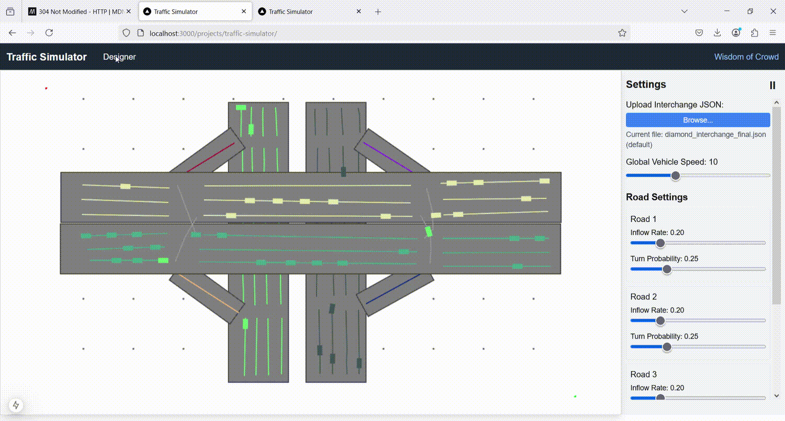
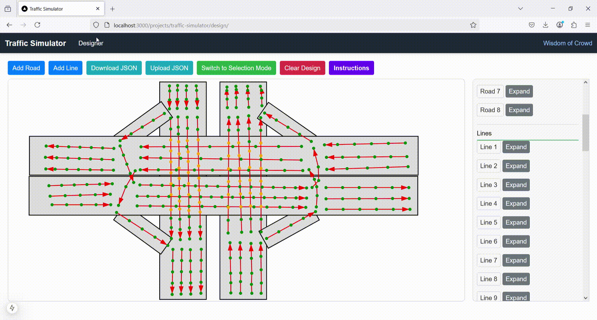

# Traffic Simulator

A full-stack web application for designing and simulating traffic patterns in road interchanges. This project provides both a design interface for creating custom road layouts and a simulation engine to visualize traffic flow.

## Demo

### Simulation Mode

*Real-time traffic simulation with adjustable parameters*

### Design Mode

*Interactive road layout design interface*

## Features

- **Design Mode**: Create and customize road layouts with an intuitive visual interface
- **Simulation Mode**: Real-time traffic simulation with adjustable parameters
- **Interactive Controls**: Modify traffic flow, vehicle speeds, and road settings
- **JSON Import/Export**: Save and load custom road layouts

## Installation

1. Clone the repository:
```bash
git clone <repository-url>
cd traffic_simulator
```

2. Install dependencies:
```bash
npm install
```

3. Run the development server:
```bash
npm run dev
```

4. Open your browser and navigate to `http://localhost:3000`

## Usage

### Design Mode (`/design`)

The design interface allows you to create custom road layouts:

1. **Adding Roads**:
   - Click "Add Road" to create a new road section
   - Drag roads to position them
   - Adjust properties (size, rotation, z-index) in the sidebar

2. **Creating Lines**:
   - Click "Add Line" to create a new traffic lane
   - Click on the canvas to add points to the line
   - Link lines to create traffic flow paths

3. **Customization**:
   - Set road properties (dimensions, rotation, z-index)
   - Configure line attributes (visibility, height)
   - Link lines to create traffic flow patterns

4. **Saving/Loading**:
   - Use "Download JSON" to save your design
   - Use "Upload JSON" to load existing designs

### Simulation Mode (`/`)

The simulation interface lets you visualize traffic flow:

1. **Controls**:
   - Pause/Resume simulation
   - Adjust global vehicle speed
   - Modify road-specific settings (inflow rate, turn probability)

2. **Road Settings**:
   - Set inflow rates for each road
   - Configure turn probabilities
   - Upload custom road layouts

3. **Visualization**:
   - Real-time traffic flow visualization
   - Vehicle movement and interaction
   - Interactive hover information


## Logic
The vehicles update their positions at a fixed interval. Vehicles are created randomly  and assigned input road and output road. Then it calculates its path based on the linking of lane lines. Vehicles are assigned a speed based on settings. Then the speed adjusts based on vehicle in front, and vehicles that are about to cross its path. Deadlock situations are handles, so that two vehicles do not wait for each other indefinitely.


## Project Structure

- `/src/app/`: Main application components
  - `page.tsx`: Main simulation view
  - `design/page.tsx`: Design interface
  - `SimulationCanvas.tsx`: Canvas rendering component
  - `SimulationSettingsBar.tsx`: Settings control panel
  - `TrafficSimulation.tsx`: Main simulation component
  - `simulationEngine.ts`: Logic of vehicle movement

## Technologies Used

- Next.js
- React
- TypeScript
- Tailwind css
- Canvas API
- Web Workers (for simulation)


